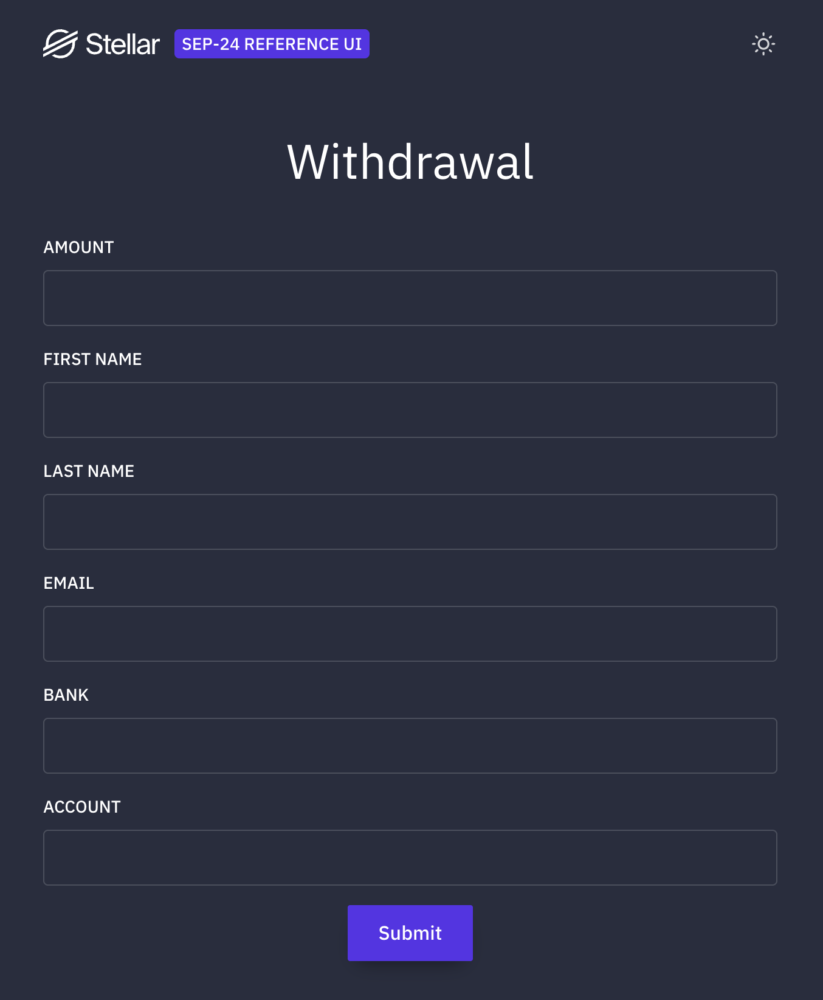

# Crossmint Stellar SEP-45

Reference implementation of
[SEP-45](https://github.com/stellar/stellar-protocol/blob/master/ecosystem/sep-0045.md)
(Web Authentication for Contract Accounts) using
[Crossmint Smart Wallets](https://docs.crossmint.com/) on Stellar.

This is the first working client-side implementation of SEP-45. It authenticates
a Soroban smart wallet's `C...` contract address directly with Stellar anchors
-- no bridge account, no proxy address, no workarounds.

## Why SEP-45?

Stellar's existing authentication standard
([SEP-10](https://github.com/stellar/stellar-protocol/blob/master/ecosystem/sep-0010.md))
only supports classic `G...` addresses. Smart wallets on Soroban use `C...`
contract addresses, which SEP-10 cannot authenticate. Until now, integrating
smart wallets with anchor services (deposits, withdrawals, KYC) required a
bridge `G...` account as an intermediary.

**SEP-45 eliminates this.** It extends Stellar web authentication to contract
accounts using Soroban authorization entries instead of transaction signatures.
The smart wallet authenticates directly, and the anchor interacts with it
natively.

> SEP-45 server-side support is already implemented in the
> [Stellar Anchor Platform](https://github.com/stellar/anchor-platform). The SDF
> test anchor (`testanchor.stellar.org`) supports the full SEP-45 + SEP-24 flow
> today.

## How It Works

```
  1. Create Wallet           2. SEP-45 Auth              3. SEP-24 Deposit/Withdraw
  ==================         ==============              ==========================

  Crossmint API              Anchor sends Soroban        Deposit: anchor sends USDC
  creates smart wallet       auth challenge              directly to C... wallet
  (C... address) with        -> sign via Crossmint       Withdraw: Crossmint Transactions
  external-wallet signer     Signatures API              API sends USDC to anchor
                             -> get JWT for SEP-24
```

The smart wallet (`C...` address) is both the authenticated identity and the
USDC holder. Withdrawal payments are sent via the Crossmint Transactions API
using a `transfer` call on the USDC Soroban Asset Contract.

### SEP-45 Authentication Flow

1. **TOML discovery** -- fetch `WEB_AUTH_FOR_CONTRACTS_ENDPOINT` from the
   anchor's `stellar.toml`
2. **Challenge** -- `GET /sep45/auth?account={C_ADDRESS}&home_domain={DOMAIN}`
3. **Sign** -- send authorization entries to Crossmint Signatures API, sign the
   preimage hash locally with the Ed25519 signer keypair, submit approval
4. **Token** -- re-encode signed entries, POST to anchor, receive JWT
5. **Use** -- JWT works with SEP-24 (deposit/withdrawal) and any other
   token-gated anchor service

### Deposit (Cash to USDC)

The CLI initiates a SEP-24 interactive deposit. The anchor provides a KYC URL.
After the user completes KYC and funds the deposit, the anchor sends USDC
directly to the `C...` smart wallet.

<details>
<summary>KYC form (SDF test anchor)</summary>


</details>

<details>
<summary>Completed deposit</summary>


</details>

### Withdraw (USDC to Cash)

The CLI initiates a SEP-24 interactive withdrawal. After KYC, the Crossmint
Transactions API sends USDC from the smart wallet to the anchor's account. The
user receives a reference code to collect cash.

If the anchor returns an `id` memo, the payment is sent to the muxed `M...`
address (anchor account + memo id in a single address). Soroban transfer events
carry no transaction memos, so the muxed destination is how off-chain systems
attribute payments from contract accounts.

<details>
<summary>Withdrawal KYC form (SDF test anchor)</summary>



</details>

> See the [end-to-end walkthrough](docs/WALKTHROUGH.md) for a full visual run of
> both flows (deposit and withdraw) against a live anchor.

## Quick Start

### Prerequisites

- [Deno 2.x](https://deno.land/)
- A [Crossmint](https://www.crossmint.com/) API key (staging or production)

### 1. Clone and install

```bash
git clone git@github.com:Crossmint/crossmint-stellar-sep45.git
cd crossmint-stellar-sep45
deno install
```

### 2. Configure environment

```bash
cp .env.example .env
# Edit .env with your Crossmint API key and signer seed
```

See [Environment Variables](#environment-variables) for details.

### 3. Generate a signer keypair

```bash
deno task generate-keys --seed "my-signer-seed"
```

The same seed always produces the same Ed25519 keypair. This keypair becomes the
external-wallet admin signer for the Crossmint smart wallet.

### 4. Create a wallet and authenticate

```bash
# Create a Crossmint smart wallet
deno task cli wallet --key "my-wallet"

# Authenticate with anchor via SEP-45
deno task cli auth

# Check balances
deno task cli balance
```

### 5. Deposit or withdraw

```bash
# Deposit: cash -> USDC (anchor sends USDC to your smart wallet)
deno task cli deposit --amount 10

# Withdraw: USDC -> cash (smart wallet sends USDC to anchor)
deno task cli withdraw --amount 10
```

## CLI Reference

```
deno task cli <command> [options]
```

| Command    | Description                               |
| ---------- | ----------------------------------------- |
| `wallet`   | Create or retrieve Crossmint smart wallet |
| `auth`     | Authenticate with anchor using SEP-45     |
| `deposit`  | Initiate cash-to-USDC deposit (SEP-24)    |
| `withdraw` | Initiate USDC-to-cash withdrawal (SEP-24) |
| `status`   | Check transaction status                  |
| `balance`  | Check wallet balances                     |

| Option      | Used by            | Description                         |
| ----------- | ------------------ | ----------------------------------- |
| `--key`     | `wallet`           | Idempotency key for wallet creation |
| `--locator` | `wallet`           | Wallet locator for retrieval        |
| `--amount`  | `deposit/withdraw` | Amount in USDC                      |
| `--id`      | `status`           | Transaction ID                      |

## Environment Variables

| Variable                    | Required                  | Description                                                               |
| --------------------------- | ------------------------- | ------------------------------------------------------------------------- |
| `CROSSMINT_API_KEY`         | Yes                       | Crossmint API key                                                         |
| `CROSSMINT_BASE_URL`        | Yes                       | API base URL (e.g., `https://staging.crossmint.com/api/2025-06-09`)       |
| `SIGNER_SEED`               | Yes                       | Seed string for deterministic Ed25519 keypair                             |
| `USDC_ISSUER`               | Yes                       | USDC asset issuer on Stellar                                              |
| `USDC_CONTRACT_ID`          | Yes                       | USDC Soroban Asset Contract address                                       |
| `ANCHOR_DOMAIN`             | No                        | Anchor domain (default: `testanchor.stellar.org`)                         |
| `STELLAR_NETWORK`           | No                        | `testnet` (default) or `mainnet`                                          |
| `CLIENT_DOMAIN`             | No                        | Domain serving your `stellar.toml` for SEP-45 `client_domain` attribution |
| `CLIENT_DOMAIN_SIGNER_SEED` | If `CLIENT_DOMAIN` is set | Seed for the keypair matching that TOML's `SIGNING_KEY`                   |

### client_domain attribution (optional)

Some anchors require `client_domain` attribution to identify the wallet provider
behind a session, separately from the user's account. Deploy
[`toml-server/`](toml-server/README.md) to a domain you control, then set
`CLIENT_DOMAIN` to that domain and `CLIENT_DOMAIN_SIGNER_SEED` to the keypair
matching its `SIGNING_KEY`. The CLI then sends `client_domain` on the challenge
and signs the extra authorization entry locally.

## Tested Against

- **SDF Test Anchor** (`testanchor.stellar.org`) -- supports SEP-45 + SEP-24
  with simplified KYC. Any test data works.
- The [Stellar Anchor Platform](https://github.com/stellar/anchor-platform) has
  server-side SEP-45 support. Any anchor running it can enable SEP-45.

## Project Structure

```
src/
  cli.ts              CLI entry point (wallet, auth, deposit, withdraw, status, balance)
  config.ts           Environment loading and validation
  crossmint.ts        Crossmint Wallet + Transactions API client
  sep45.ts            SEP-45 contract account authentication
  sep24.ts            SEP-24 interactive deposit/withdrawal
  toml.ts             Stellar TOML discovery
  http.ts             HTTP client with exponential backoff retry
  keys.ts             Deterministic keypair derivation (SHA-256 -> Ed25519)
  logger.ts           Timestamped logging
scripts/
  generate-keys.ts    Keypair generation utility
  decode-challenge.ts Decode an anchor's SEP-45 challenge for debugging
toml-server/
  api/index.ts        Vercel host for your stellar.toml (client_domain)
docs/
  GETTING_STARTED.md  Detailed setup guide
  WALKTHROUGH.md      Visual end-to-end deposit + withdraw run
  SEP45_POSTMAN_FLOWS.md  Step-by-step Postman testing for SEP-45
  TROUBLESHOOTING.md  Common issues and fixes
```

## Stellar Protocol References

- [SEP-45: Web Authentication for Contract Accounts](https://github.com/stellar/stellar-protocol/blob/master/ecosystem/sep-0045.md)
- [SEP-24: Interactive Deposit and Withdrawal](https://github.com/stellar/stellar-protocol/blob/master/ecosystem/sep-0024.md)
- [SEP-1: Stellar Info File (stellar.toml)](https://github.com/stellar/stellar-protocol/blob/master/ecosystem/sep-0001.md)
- [Stellar Anchor Platform](https://github.com/stellar/anchor-platform)

## License

MIT
