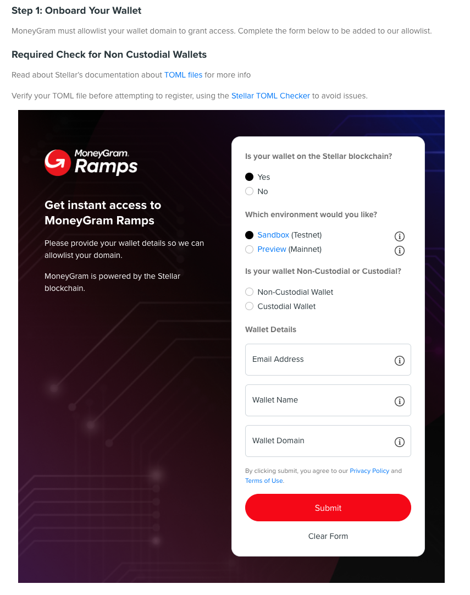
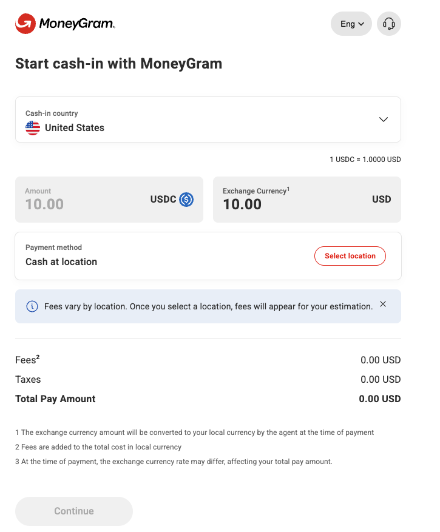
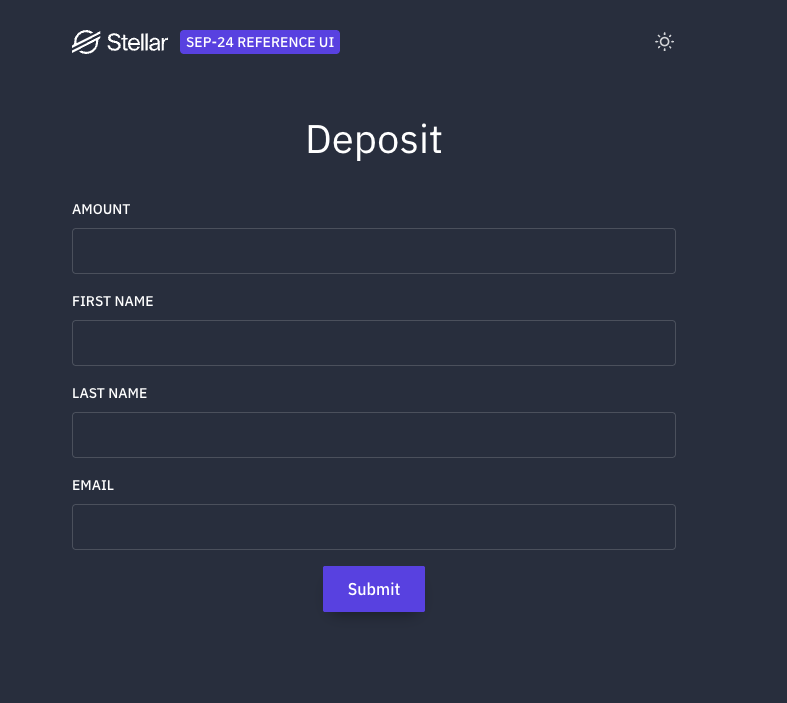
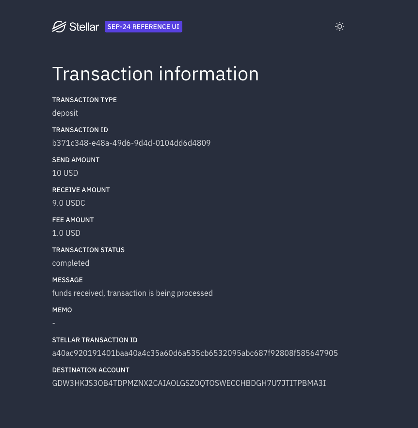

# Getting Started

Step-by-step guide to set up the MoneyGram x Crossmint Stellar integration from scratch.

## Prerequisites

- [Deno 2.x](https://deno.land/) installed
- A [GitHub](https://github.com/) account (for Vercel deployment)
- A [Vercel](https://vercel.com/) account (free tier works)
- A [Crossmint](https://www.crossmint.com/) account

## Step 1: Create a Crossmint Project

1. Go to [Crossmint Staging Console](https://staging.crossmint.com/console)
2. Sign up or log in
3. Create a new project
4. Navigate to **API Keys** and create a **server-side** API key
5. Ensure the key has permissions for:
   - Wallets: Create, Read
   - Wallet Balances: Read
6. Copy the API key. You will use it as `CROSSMINT_API_KEY` in your `.env`

The base URL for staging is: `https://staging.crossmint.com/api/2025-06-09`

Reference: [Crossmint API Docs](https://docs.crossmint.com/api-reference/wallets/create-wallet)

## Step 2: Clone and Install

```bash
git clone git@github.com:Crossmint/crossmint-moneygram-ramp.git
cd crossmint-moneygram-ramp
deno install
```

## Step 3: Generate Deterministic Keypairs

Generate two keypairs: one for the bridge account and one for client_domain signing.

```bash
# Bridge account keypair
deno task generate-keys --seed "my-bridge-account-seed"
# Note the G... public key output

# Client domain signing keypair
deno task generate-keys --seed "my-client-signing-seed"
# Note the G... public key output (this goes in the TOML server)
```

Choose memorable, unique seed strings. The same seed always produces the same keypair. See [src/keys.ts](../src/keys.ts) for the derivation process (SHA-256 + Ed25519).

## Step 4: Configure Environment

```bash
cp .env.example .env
```

Fill in your `.env`:

```env
# From Step 1
CROSSMINT_API_KEY="sk_staging_..."
CROSSMINT_BASE_URL="https://staging.crossmint.com/api/2025-06-09"

# From Step 3 (the seed strings, NOT the keys)
BRIDGE_SEED="my-bridge-account-seed"
CLIENT_SIGNING_SEED="my-client-signing-seed"

# MoneyGram sandbox anchor
MONEYGRAM_DOMAIN="extstellar.moneygram.com"
USDC_ISSUER="GBBD47IF6LWK7P7MDEVSCWR7DPUWV3NY3DTQEVFL4NAT4AQH3ZLLFLA5"

# Your TOML server domain (from Step 5)
CLIENT_DOMAIN="your-app.vercel.app"

# Network
STELLAR_NETWORK="testnet"
```

## Step 5: Deploy TOML Server to Vercel

The TOML server provides `/.well-known/stellar.toml` for SEP-10 client_domain verification. Anchors fetch this to verify your application.

Reference: [SEP-1 (stellar.toml)](https://github.com/stellar/stellar-protocol/blob/master/ecosystem/sep-0001.md)

### 5a. Test locally first

```bash
TOML_SIGNING_KEY="G...your-client-domain-public-key" deno task toml-dev
```

Verify in another terminal:

```bash
curl http://localhost:8000/.well-known/stellar.toml
curl http://localhost:8000/health
```

The `SIGNING_KEY` in the TOML output must match the public key derived from your `CLIENT_SIGNING_SEED`.

### 5b. Deploy to Vercel

1. Install the [Vercel CLI](https://vercel.com/docs/cli): `npm i -g vercel`
2. Navigate to the TOML server directory:
   ```bash
   cd toml-server
   ```
3. Deploy:
   ```bash
   vercel
   ```
4. Set environment variables on Vercel:
   - `TOML_SIGNING_KEY` = the G... public key from your client domain keypair (Step 3)
   - `TOML_ACCOUNTS` = the G... public key from your bridge account keypair (Step 3, optional)
5. Redeploy after setting env vars:
   ```bash
   vercel --prod
   ```
6. Note your deployment URL (e.g., `your-app.vercel.app`). Set this as `CLIENT_DOMAIN` in your `.env`.

### 5c. Verify TOML is accessible

```bash
curl https://your-app.vercel.app/.well-known/stellar.toml
```

You can also use the [Stellar TOML Checker](https://stellar.org/laboratory) to validate your TOML.

## Step 6: Fund the Bridge Account

On testnet, the CLI uses Friendbot to fund the account and set up the USDC trustline:

```bash
deno task cli setup
```

This:
1. Funds the bridge account with 10,000 XLM (testnet only, via [Friendbot](https://friendbot.stellar.org/))
2. Creates a trustline for USDC (issued by `GBBD47IF6LWK7P7MDEVSCWR7DPUWV3NY3DTQEVFL4NAT4AQH3ZLLFLA5`)

Verify:

```bash
deno task cli balance
```

## Step 7: Create a Crossmint Smart Wallet

```bash
# Create a new wallet (use --key for idempotent creation)
deno task cli wallet --key "my-user-wallet"

# Or retrieve an existing wallet
deno task cli wallet --locator "email:robin@paella.dev"
```

The `--key` flag ensures that calling wallet creation multiple times with the same key returns the same wallet instead of creating duplicates. The key is combined with your Crossmint project ID server-side.

Reference: [Crossmint Wallets API](https://docs.crossmint.com/api-reference/wallets/create-wallet)

## Step 8: Submit MoneyGram Onboarding Form

MoneyGram's Stellar sandbox requires partner onboarding. Submit the self-service form:

1. Go to [MoneyGram Access Ramps Developer Portal](https://developer.moneygram.com/)
2. Navigate to the onboarding/integration section
3. Verify your TOML file using the [Stellar TOML Checker](https://stellar.sui.li/) before submitting
4. Fill in the form with:
   - **Is your wallet on the Stellar blockchain?** Yes
   - **Environment**: Sandbox (Testnet)
   - **Wallet Type**: Non-Custodial Wallet
   - **Email Address**: robin@paella.dev
   - **Wallet Name**: Crossmint MoneyGram Ramp
   - **Wallet Domain**: your Vercel domain (e.g., `crossmint-moneygram-ramp.vercel.app`)



MoneyGram will allowlist your wallet domain for sandbox access. If the self-service form returns an error, email MGRamps@moneygram.com with your details and TOML URL.

Reference: [MoneyGram Access Ramps Integration Guide](https://developer.moneygram.com/moneygram-developer/docs/integrate-moneygram-ramps)

### While waiting for MoneyGram approval

You can test the full SEP-10/SEP-24 flow against the SDF reference anchor without any onboarding. Just prefix commands with `MONEYGRAM_DOMAIN="testanchor.stellar.org"` or set it in your `.env`. See [Step 10: Deposit and Withdraw](#step-10-deposit-and-withdraw) for the full walkthrough with screenshots.

## Step 9: Authenticate with MoneyGram

Once approved (or using the SDF test anchor):

```bash
deno task cli auth
```

This performs SEP-10 challenge-response authentication:
1. Fetches the anchor's `stellar.toml` to discover endpoints
2. Requests a challenge transaction from the anchor
3. Validates the challenge (sequence=0, timebounds, source account)
4. Signs with bridge keypair (and client_domain keypair if configured)
5. Submits the signed challenge to receive a JWT

The JWT is saved to `.auth-token` for subsequent commands.

Reference: [SEP-10 Web Authentication](https://github.com/stellar/stellar-protocol/blob/master/ecosystem/sep-0010.md)

## Step 10: Deposit and Withdraw

### Deposit (Cash to USDC)

```bash
deno task cli deposit --amount 10
```

1. Initiates an interactive SEP-24 deposit
2. Prints a URL for KYC completion in the anchor's webview
3. After KYC + cash deposit, USDC is sent to the bridge account
4. CLI polls for completion automatically

#### MoneyGram Deposit Flow

Open the interactive URL printed by the CLI. MoneyGram's webview walks you through the cash-in process:



Select your country, enter the amount, and choose a payment location. For sandbox testing, use the [MoneyGram test data for cash-in locations](https://developer.moneygram.com/moneygram-developer/docs/on-ramp-cash-in-location-test-data).

#### How it works without MoneyGram

You can test the full deposit flow using the [SDF reference anchor](https://testanchor.stellar.org) (`testanchor.stellar.org`) without any MoneyGram onboarding. The SDF anchor implements the same SEP-10/SEP-24 protocol but uses a simplified KYC form instead of real identity verification:

```bash
MONEYGRAM_DOMAIN="testanchor.stellar.org" deno task cli auth
MONEYGRAM_DOMAIN="testanchor.stellar.org" deno task cli deposit --amount 10
```

The CLI prints an interactive URL. Open it in your browser to see the test KYC form:



Fill in any test data and submit. The anchor simulates the deposit: it sends testnet USDC to your bridge account just like MoneyGram would after a real cash deposit. The CLI detects the status change and completes automatically.

#### Example: Successful Deposit



The screenshot above shows a completed deposit:

| Field | Value |
|---|---|
| Transaction Type | deposit |
| Send Amount | 10 USD |
| Receive Amount | 9.0 USDC |
| Fee Amount | 1.0 USD |
| Transaction Status | completed |
| Destination Account | GDW3HKJS3OB4TDPMZNX2CAIAOLGSZOQTOSWECCHBDGH7U7JTITPBMA3I (bridge) |

After the deposit completes, check your bridge account balance:

```bash
deno task cli balance
```

Expected output:
```
Bridge account: GDW3HKJS3OB4TDPMZNX2CAIAOLGSZOQTOSWECCHBDGH7U7JTITPBMA3I
  USDC:GBBD47IF6LWK7P7MDEVSCWR7DPUWV3NY3DTQEVFL4NAT4AQH3ZLLFLA5: 9.0000000
  XLM: 9999.9999900
```

### Withdraw (USDC to Cash)

```bash
deno task cli withdraw --amount 50
```

1. Initiates an interactive SEP-24 withdrawal
2. Prints a URL for KYC completion
3. When the anchor is ready, the CLI sends USDC from the bridge account to the anchor
4. User receives a reference code to pick up cash at MoneyGram

### Check Status

```bash
deno task cli status --id <transaction-id>
```

Reference: [SEP-24 Interactive Anchor/Wallet Deposit and Withdrawal](https://github.com/stellar/stellar-protocol/blob/master/ecosystem/sep-0024.md)

## Troubleshooting

See [docs/TROUBLESHOOTING.md](TROUBLESHOOTING.md) for common issues and fixes.

## Summary Checklist

- [ ] Crossmint staging project created with API key
- [ ] Dependencies installed (`deno install`)
- [ ] Bridge and client_domain keypairs generated from seeds
- [ ] `.env` configured with all required variables
- [ ] TOML server deployed to Vercel with correct `TOML_SIGNING_KEY`
- [ ] TOML accessible at `https://<domain>/.well-known/stellar.toml`
- [ ] Bridge account funded and USDC trustline established
- [ ] Crossmint smart wallet created
- [ ] MoneyGram onboarding form submitted
- [ ] SEP-10 authentication tested
- [ ] Deposit/withdrawal flows tested
