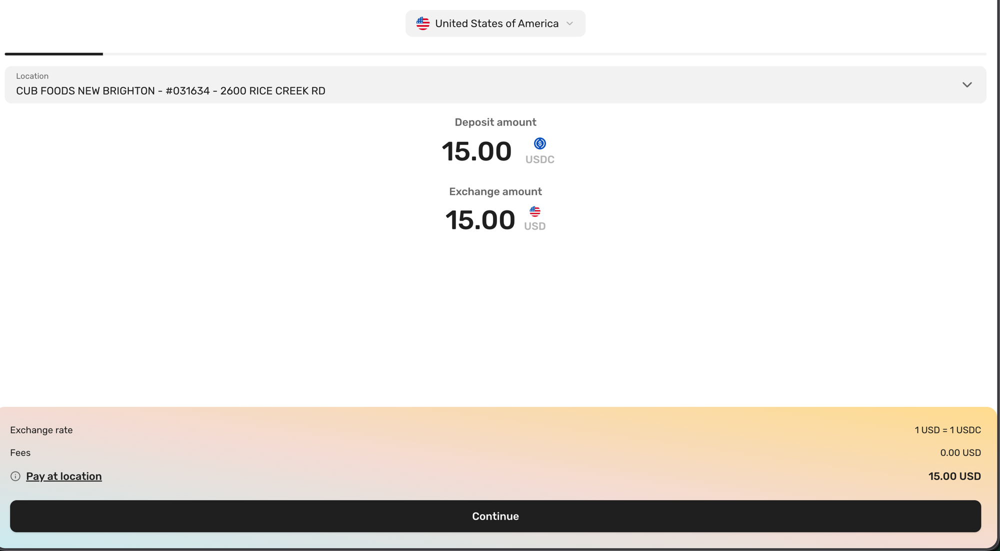
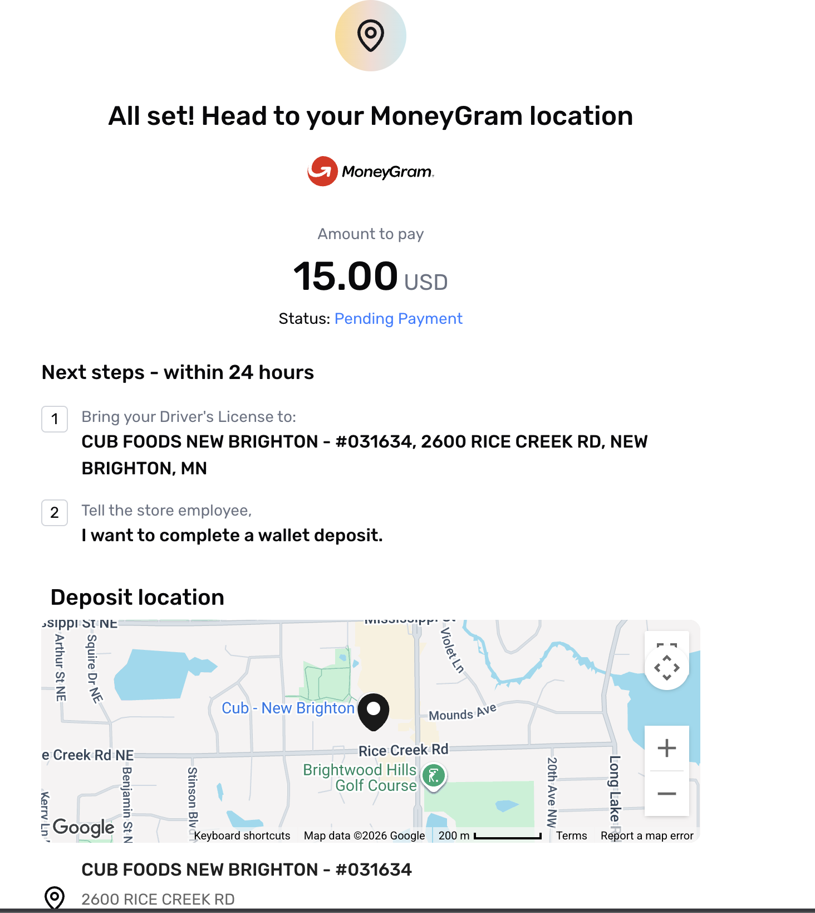
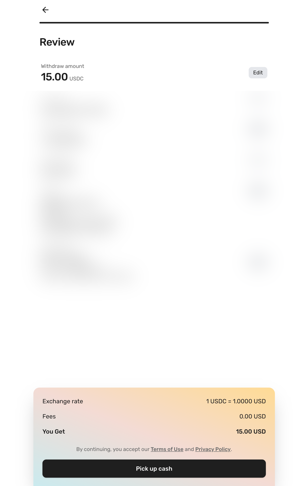
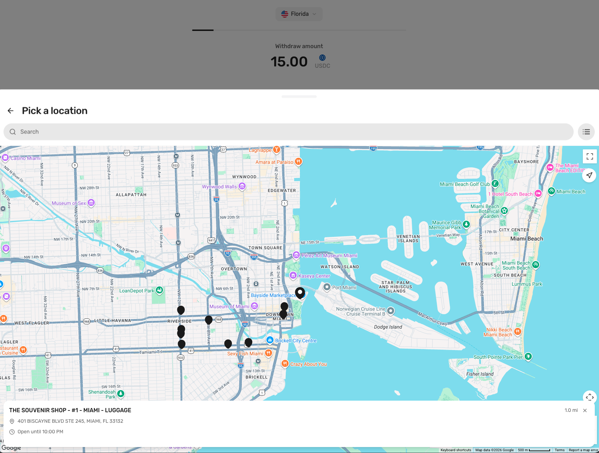
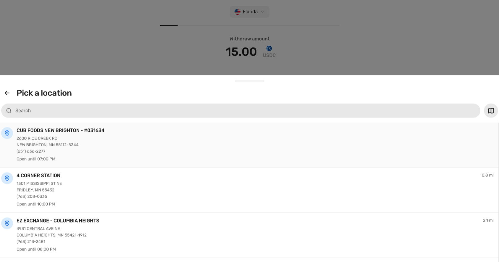
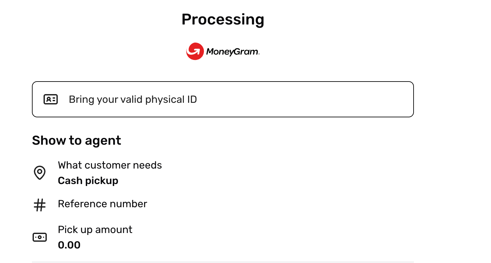
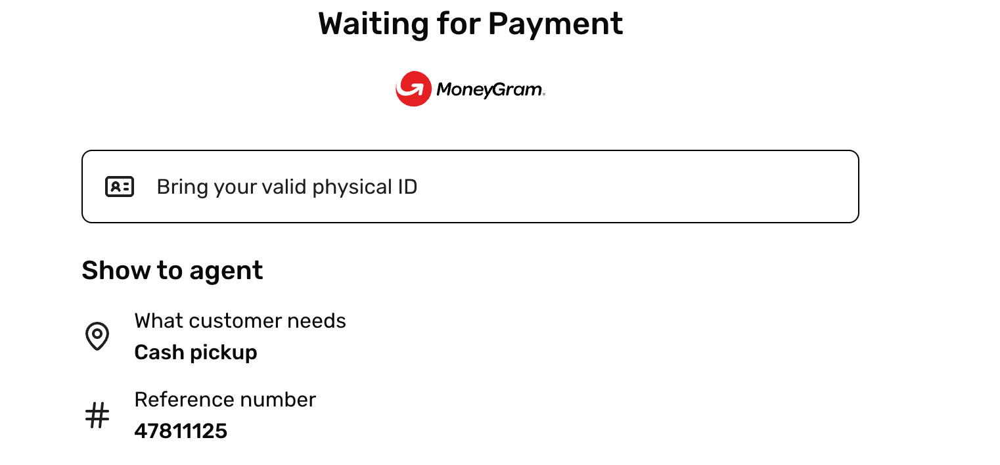

# End-to-End Walkthrough

A complete on/off-ramp on a Stellar smart wallet, captured from a real run.

The example anchor here is the **MoneyGram test anchor**
(`extmgxanchor.moneygram.com`), which runs the
[Stellar Anchor Platform](https://github.com/stellar/anchor-platform) with
SEP-45 support and exercises the full interactive flow: KYC, agent locations,
cash pay-in, and cash pickup. The same CLI works against any SEP-45 anchor (for
example the SDF test anchor, `testanchor.stellar.org`).

Throughout, the authenticated identity and the USDC holder are the same `C...`
Soroban smart wallet --
[`CCL3SYBSKT4DA3NVRHXR3RJ5O7G34E3CCQBMT47TRTCAA727FNVFWMU7`](https://stellar.expert/explorer/testnet/contract/CCL3SYBSKT4DA3NVRHXR3RJ5O7G34E3CCQBMT47TRTCAA727FNVFWMU7).
There is no bridge `G...` account anywhere in the flow.

> Personal KYC details in these screenshots have been blurred.

## Deposit -- cash to USDC

`deno task cli deposit --amount 15` initiates a SEP-24 interactive deposit and
returns a URL. The user completes KYC, confirms the amount, pays cash at a
MoneyGram agent, and the anchor delivers USDC straight to the `C...` wallet.

**1. Complete KYC**

**2. Confirm the amount** -- a 1:1, fee-free quote: 15 USDC for 15 USD.

**3. Head to the agent and pay cash** -- the anchor stages the transaction and
shows where to pay.

**4. USDC delivered on-chain** -- 15 USDC lands directly in the smart wallet.
Proof:
[deposit transaction](https://stellar.expert/explorer/testnet/tx/12391448800428032).

## Withdraw -- USDC to cash

`deno task cli withdraw --amount 15` initiates a SEP-24 interactive withdrawal.
After the quote and location pick, the anchor waits for the wallet to send USDC
on-chain. The CLI signs and submits that transfer via the Crossmint Transactions
API, and the user collects cash at the agent with a reference number.

**1. Confirm the amount** -- a 1:1 quote with the partner fee waived by promo.
KYC details blurred.

**2. Pick a pickup location** -- by map or list.

**3. The anchor waits for the on-chain payment** -- the transaction sits at
`pending_user_transfer_start` until the wallet delivers the USDC.

**4. The wallet sends USDC and cash is released** -- the CLI sends 15 USDC from
the smart wallet to the anchor (a `transfer` on the USDC Soroban Asset Contract,
signed by the wallet's admin signer). Proof:
[withdraw payment transaction](https://stellar.expert/explorer/testnet/tx/337206b608ab2a808c9a3576eb563564d4c362c4ce8a99a1c403a3b5204c9f45).
The anchor then releases the cash for pickup against the reference number.

## A note on contract-account support

Make sure account-existence is checked in a contract-aware way. Classic Horizon
`/accounts/{id}` lookups only resolve `G...` addresses, so any source-account
validation that uses them will reject a `C...` smart wallet even though it is
live on-chain. The current
[Stellar Anchor Platform](https://github.com/stellar/anchor-platform) handles
contract accounts on both deposit and withdraw. See
[TROUBLESHOOTING.md](TROUBLESHOOTING.md) for the specific cases encountered
during this integration and how they were resolved.
